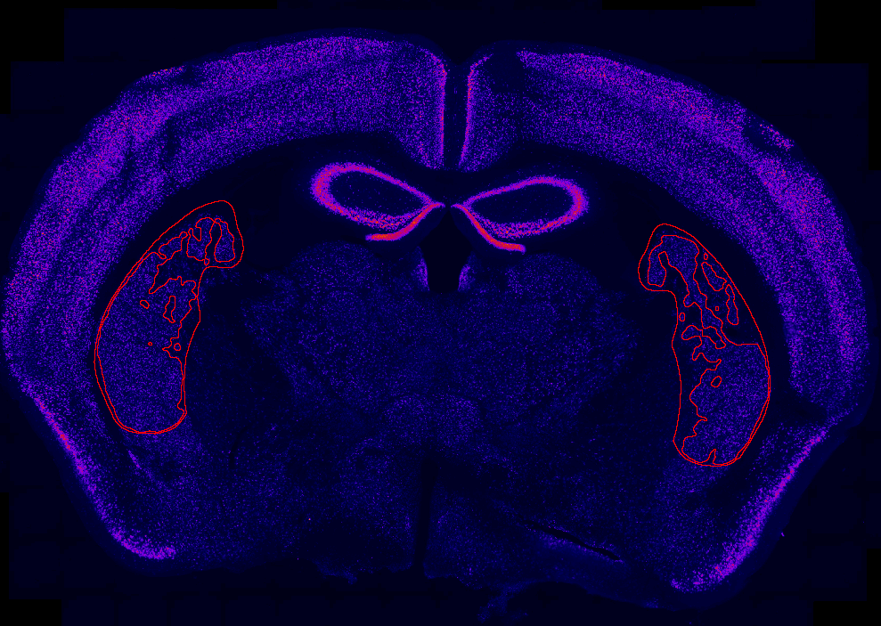

# quantification-of-lesions
What is does

### Installation

It depends on functions that are located in the following repo, so make sure you have them in your Fiji:

https://github.com/HernandoMV/czi-rs-functions

### Usage

# Workflow for quantifying lesions
0. This assumes image acquisition with at least 2 channels (DAPI and NeuN) or slices that are well oriented in DV
  - Make sure the name of the .czi files is 'Animal-X-Y-Z_Experimental-Procedure_slide-X.czi
  - The underscores are very important. Don't have spaces. The last part (e.g. '..._slide-1') is also crucial.

1. Use https://github.com/HernandoMV/czi-extract-slices in Fiji to export slices. (Using channels 1,3 for example and 10um/px)

2. Register with ABBA (see this repo for instructions: https://github.com/HernandoMV/ph3-analysis), but DO NOT tilt the atlas much.

3. Get the lesioned area running get_lesion_area.py in Fiji

  
  <figcaption align = "center"><b>Output of get_lesion_area.py</b></figcaption>

4. Register ROIs to ARA with register_ROIs_to_ARA.py

5. Quantify the lesions using quantify_lesions.py

6. Plot and visualise results using load_lesion_stacks.py and plot_lesions.py

