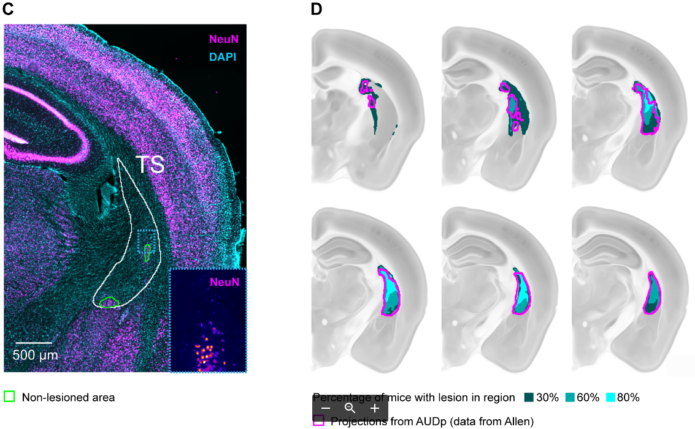

# quantification-of-lesions
Uses histological data stained with NeuN and imaged in the Slide Scanner to quantify the proportion of tissue that has been lesioned (e.g. using caspase)
You can generate figures such as this one with the data that this pipeline outputs, and some automatic quantifications:
<p align="middle">
  
</p>

### Installation

It depends on functions that are located in the following repo, so make sure you have them in your Fiji:

https://github.com/HernandoMV/czi-rs-functions


### Usage workflow
0. This assumes image acquisition with at least 2 channels (DAPI and NeuN) or slices that are well oriented in DV
  - Make sure the name of the .czi files is 'Animal-X-Y-Z_Experimental-Procedure_slide-X.czi
  - The underscores are very important. Don't have spaces. The last part (e.g. '..._slide-1') is also crucial.

1. Use https://github.com/HernandoMV/czi-extract-slices in Fiji to export slices. (Using channels 1,3 for example and 10um/px)

2. Register with ABBA (see this repo for instructions: https://github.com/HernandoMV/ph3-analysis), but DO NOT tilt the atlas much.

3. Get the lesioned area running ```get_lesion_area.py``` in Fiji.
<p align="middle">
  
</p>

4. Register ROIs to ARA with ```register_ROIs_to_ARA.py``` in Fiji. You need to specify the path to the Allen Brain Atlas and the resolution.
<p align="middle">
  
</p>

5. Visualise results using ```load_lesion_stacks.py``` in Fiji, which overlays the data of all animals into the atlas.

6. Quantify the lesions using ```quantify_lesions.py``` in Fiji. Uses a couple of extra files that indicate where different anatomical structures are.
It creates two text files that will be used by the next script.

7. Run ```plot_lesions.py``` in Python to generate graphs like this one:
<p align="middle">
  
</p>

### TODO:
1. Move here the .ijm file in brain_visualizations repo for creating the main plot, and add the necesary data and instructions to generate the figure in Fiji
